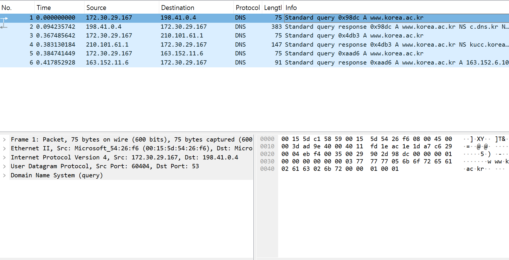
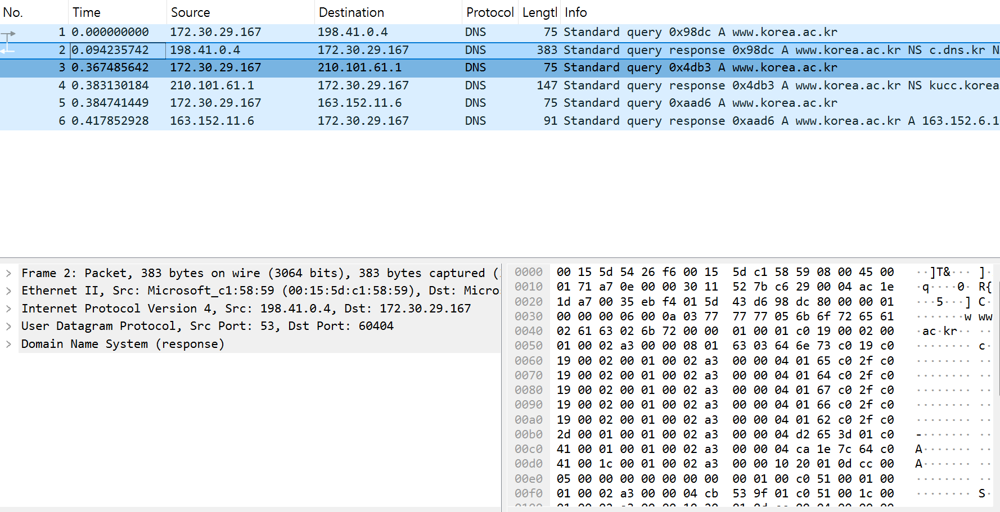
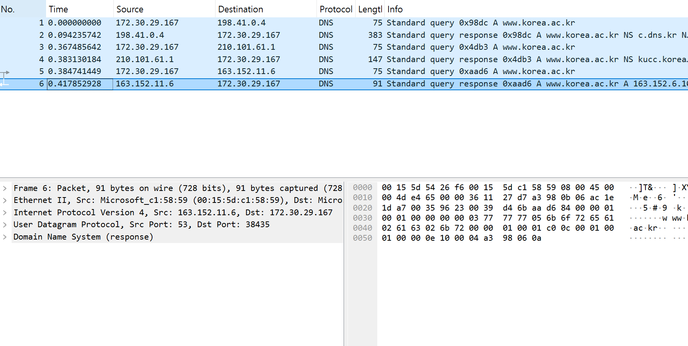

# DNS / CDN 실제 측정 보고서

## 측정 범위

네트워크: home-wifi, other-wifi
네트워크 이름: home-wifi = 집 Wi-Fi, other-wifi = 사용자가 전환을 확인한 다른 Wi-Fi.
측정 날짜(UTC): home-wifi = 2026-09-22; other-wifi = 2026-09-24
Resolvers: system, Google 8.8.8.8, Quad9 9.9.9.9. 시각은 원본 JSON의 UTC.
system은 JSON의 servers에 기록된 WSL DNS 프록시다. 최종 업스트림 리졸버 위치는 확인하지 않았다.
동일 네트워크·리졸버의 최신 측정을 비교했다. 실패/빈 응답은 차이로 세지 않았다.
체인 길이는 CNAME 간선 수다. 최종 구역은 SOA로 확인하며, 확인 실패는 미확정으로 표시한다.

## Third-party 판정 규칙

검사할 단순 규칙: 원래 이름과 마지막 이름의 마지막 두 레이블이 다르면 third-party로 판정한다.
이는 등록 도메인/운영자 판정이 아니다. co.uk·ac.kr 같은 접미사와 동일 회사의 여러 도메인에서 오류가 난다.
보정 판정: 알려진 CDN 도메인과 운영자 문서를 함께 확인한다. 근거 없는 경우 미확정이다.

| 사이트 | 네트워크 / resolver | 체인 길이 | 최종 구역 | Third-party 보정 판정 | 단순 규칙 판결 |
|---|---|---:|---|---|---|
| www.adobe.com | home-wifi / google | 2 | dscr.akamai.net | 예 (Akamai) | 제3자 |
| www.adobe.com | home-wifi / quad9 | 2 | dscr.akamai.net | 예 (Akamai) | 제3자 |
| www.adobe.com | home-wifi / system | 2 | dscr.akamai.net | 예 (Akamai) | 제3자 |
| www.adobe.com | other-wifi / google | 2 | dscr.akamai.net | 예 (Akamai) | 제3자 |
| www.adobe.com | other-wifi / quad9 | 2 | 미확정 | 예 (Akamai) | 제3자 |
| www.adobe.com | other-wifi / system | 2 | dscr.akamai.net | 예 (Akamai) | 제3자 |
| www.apple.com | home-wifi / google | 3 | dsce9.akamaiedge.net | 예 (Akamai) | 제3자 |
| www.apple.com | home-wifi / quad9 | 3 | dsce9.akamaiedge.net | 예 (Akamai) | 제3자 |
| www.apple.com | home-wifi / system | 3 | dsce9.akamaiedge.net | 예 (Akamai) | 제3자 |
| www.apple.com | other-wifi / google | 3 | dsce9.akamaiedge.net | 예 (Akamai) | 제3자 |
| www.apple.com | other-wifi / quad9 | 3 | dsce9.akamaiedge.net | 예 (Akamai) | 제3자 |
| www.apple.com | other-wifi / system | 3 | dsce9.akamaiedge.net | 예 (Akamai) | 제3자 |
| www.bbc.co.uk | home-wifi / google | 2 | fastly.net | 예 (Fastly) | 제3자 |
| www.bbc.co.uk | home-wifi / quad9 | 2 | fastly.net | 예 (Fastly) | 제3자 |
| www.bbc.co.uk | home-wifi / system | 2 | fastly.net | 예 (Fastly) | 제3자 |
| www.bbc.co.uk | other-wifi / google | 2 | 미확정 | 예 (Fastly) | 제3자 |
| www.bbc.co.uk | other-wifi / quad9 | 2 | fastly.net | 예 (Fastly) | 제3자 |
| www.bbc.co.uk | other-wifi / system | 2 | fastly.net | 예 (Fastly) | 제3자 |
| www.cnn.com | home-wifi / google | 1 | fastly.net | 예 (Fastly) | 제3자 |
| www.cnn.com | home-wifi / quad9 | 1 | fastly.net | 예 (Fastly) | 제3자 |
| www.cnn.com | home-wifi / system | 1 | fastly.net | 예 (Fastly) | 제3자 |
| www.cnn.com | other-wifi / google | 1 | fastly.net | 예 (Fastly) | 제3자 |
| www.cnn.com | other-wifi / quad9 | 1 | fastly.net | 예 (Fastly) | 제3자 |
| www.cnn.com | other-wifi / system | 1 | fastly.net | 예 (Fastly) | 제3자 |
| www.github.com | home-wifi / google | 1 | github.com | 미확정 | 동일 |
| www.github.com | home-wifi / quad9 | 1 | github.com | 미확정 | 동일 |
| www.github.com | home-wifi / system | 1 | github.com | 미확정 | 동일 |
| www.github.com | other-wifi / google | 1 | github.com | 미확정 | 동일 |
| www.github.com | other-wifi / quad9 | 1 | github.com | 미확정 | 동일 |
| www.github.com | other-wifi / system | 1 | github.com | 미확정 | 동일 |
| www.korea.ac.kr | home-wifi / google | 0 | korea.ac.kr | 미확정 | 동일 |
| www.korea.ac.kr | home-wifi / quad9 | 0 | korea.ac.kr | 미확정 | 동일 |
| www.korea.ac.kr | home-wifi / system | 0 | korea.ac.kr | 미확정 | 동일 |
| www.korea.ac.kr | other-wifi / google | 0 | korea.ac.kr | 미확정 | 동일 |
| www.korea.ac.kr | other-wifi / quad9 | 0 | korea.ac.kr | 미확정 | 동일 |
| www.korea.ac.kr | other-wifi / system | 0 | korea.ac.kr | 미확정 | 동일 |
| www.microsoft.com | home-wifi / google | 2 | dscb.akamaiedge.net | 예 (Akamai) | 제3자 |
| www.microsoft.com | home-wifi / quad9 | 2 | dscb.akamaiedge.net | 예 (Akamai) | 제3자 |
| www.microsoft.com | home-wifi / system | 2 | dscb.akamaiedge.net | 예 (Akamai) | 제3자 |
| www.microsoft.com | other-wifi / google | 2 | dscb.akamaiedge.net | 예 (Akamai) | 제3자 |
| www.microsoft.com | other-wifi / quad9 | 2 | dscb.akamaiedge.net | 예 (Akamai) | 제3자 |
| www.microsoft.com | other-wifi / system | 2 | dscb.akamaiedge.net | 예 (Akamai) | 제3자 |
| www.netflix.com | home-wifi / google | 1 | prod.ftl.netflix.com | 미확정 (웹 호스팅과 영상 CDN 구분) | 동일 |
| www.netflix.com | home-wifi / quad9 | 1 | prod.ftl.netflix.com | 미확정 (웹 호스팅과 영상 CDN 구분) | 동일 |
| www.netflix.com | home-wifi / system | 1 | prod.ftl.netflix.com | 미확정 (웹 호스팅과 영상 CDN 구분) | 동일 |
| www.netflix.com | other-wifi / google | 1 | prod.ftl.netflix.com | 미확정 (웹 호스팅과 영상 CDN 구분) | 동일 |
| www.netflix.com | other-wifi / quad9 | 1 | prod.ftl.netflix.com | 미확정 (웹 호스팅과 영상 CDN 구분) | 동일 |
| www.netflix.com | other-wifi / system | 1 | prod.ftl.netflix.com | 미확정 (웹 호스팅과 영상 CDN 구분) | 동일 |
| www.nytimes.com | home-wifi / google | 3 | fastly.net | 예 (Fastly) | 제3자 |
| www.nytimes.com | home-wifi / quad9 | 3 | fastly.net | 예 (Fastly) | 제3자 |
| www.nytimes.com | home-wifi / system | 3 | fastly.net | 예 (Fastly) | 제3자 |
| www.nytimes.com | other-wifi / google | 3 | fastly.net | 예 (Fastly) | 제3자 |
| www.nytimes.com | other-wifi / quad9 | 3 | fastly.net | 예 (Fastly) | 제3자 |
| www.nytimes.com | other-wifi / system | 3 | fastly.net | 예 (Fastly) | 제3자 |
| www.spotify.com | home-wifi / google | 1 | fastly.net | 예 (Fastly) | 제3자 |
| www.spotify.com | home-wifi / quad9 | 1 | fastly.net | 예 (Fastly) | 제3자 |
| www.spotify.com | home-wifi / system | 1 | fastly.net | 예 (Fastly) | 제3자 |
| www.spotify.com | other-wifi / google | 1 | fastly.net | 예 (Fastly) | 제3자 |
| www.spotify.com | other-wifi / quad9 | 1 | fastly.net | 예 (Fastly) | 제3자 |
| www.spotify.com | other-wifi / system | 1 | fastly.net | 예 (Fastly) | 제3자 |
| www.stanford.edu | home-wifi / google | 1 | netlifyglobalcdn.com | 예 (Netlify) | 제3자 |
| www.stanford.edu | home-wifi / quad9 | 1 | netlifyglobalcdn.com | 예 (Netlify) | 제3자 |
| www.stanford.edu | home-wifi / system | 1 | netlifyglobalcdn.com | 예 (Netlify) | 제3자 |
| www.stanford.edu | other-wifi / google | 1 | netlifyglobalcdn.com | 예 (Netlify) | 제3자 |
| www.stanford.edu | other-wifi / quad9 | 1 | netlifyglobalcdn.com | 예 (Netlify) | 제3자 |
| www.stanford.edu | other-wifi / system | 1 | netlifyglobalcdn.com | 예 (Netlify) | 제3자 |
| www.wikipedia.org | home-wifi / google | 1 | wikimedia.org | 아니오 (Wikimedia 자체 CDN) | 제3자 |
| www.wikipedia.org | home-wifi / quad9 | 1 | wikimedia.org | 아니오 (Wikimedia 자체 CDN) | 제3자 |
| www.wikipedia.org | home-wifi / system | 1 | wikimedia.org | 아니오 (Wikimedia 자체 CDN) | 제3자 |
| www.wikipedia.org | other-wifi / google | 1 | wikimedia.org | 아니오 (Wikimedia 자체 CDN) | 제3자 |
| www.wikipedia.org | other-wifi / quad9 | 1 | wikimedia.org | 아니오 (Wikimedia 자체 CDN) | 제3자 |
| www.wikipedia.org | other-wifi / system | 1 | wikimedia.org | 아니오 (Wikimedia 자체 CDN) | 제3자 |

## Steering number (B5)

비교 가능한 CDN 호스팅 사이트 9개 중 7개가 서로 다른 resolver 또는 네트워크에서 다른 A 주소 집합을 보였다.
차이 발생 사이트: www.adobe.com, www.apple.com, www.bbc.co.uk, www.cnn.com, www.microsoft.com, www.nytimes.com, www.spotify.com
같은 resolver를 두 네트워크에서 비교했을 때 차이 발생: 3개.
이 분모는 CNAME 제공자 또는 Wikimedia 문서로 CDN 근거를 확보한 사이트만 포함한다. 미확정 사이트는 제외한다.
- home-wifi: CDN 9개 중 7개가 resolver에 따라 달랐다.
- other-wifi: CDN 9개 중 6개가 resolver에 따라 달랐다.

## 리졸버별 원본 주소 집합 (B2)

원래 사이트 이름에 대한 첫 응답의 A 집합을 비교한다. CNAME만 받은 경우 전체 체인을 해결한 최종 집합을 사용한다.
각 단계의 원문 응답, TTL, 질의 ID, 시각, 실제 DNS 서버 주소는 chains.json에 보존했다.

| 사이트 | 네트워크 / resolver | A 주소 집합 |
|---|---|---|
| www.adobe.com | home-wifi / google | 23.67.53.168, 23.67.53.170 |
| www.adobe.com | home-wifi / quad9 | 2.22.234.100, 2.22.234.120 |
| www.adobe.com | home-wifi / system | 23.35.218.148, 23.35.218.149 |
| www.adobe.com | other-wifi / google | 23.76.153.115, 23.76.153.121 |
| www.adobe.com | other-wifi / quad9 | 23.32.4.104, 23.32.4.74, 23.32.4.75, 23.32.4.80, 23.32.4.88, 23.32.4.91, 23.32.4.96, 23.32.4.97, 23.32.4.99 |
| www.adobe.com | other-wifi / system | 101.235.255.178, 101.235.255.184 |
| www.apple.com | home-wifi / google | 23.217.69.53 |
| www.apple.com | home-wifi / quad9 | 23.217.180.246 |
| www.apple.com | home-wifi / system | 104.94.216.37 |
| www.apple.com | other-wifi / google | 184.31.228.249 |
| www.apple.com | other-wifi / quad9 | 23.49.205.28 |
| www.apple.com | other-wifi / system | 23.49.205.28 |
| www.bbc.co.uk | home-wifi / google | 151.101.0.81, 151.101.128.81, 151.101.192.81, 151.101.64.81 |
| www.bbc.co.uk | home-wifi / quad9 | 151.101.0.81, 151.101.128.81, 151.101.192.81, 151.101.64.81 |
| www.bbc.co.uk | home-wifi / system | 146.75.48.81 |
| www.bbc.co.uk | other-wifi / google | 151.101.0.81, 151.101.128.81, 151.101.192.81, 151.101.64.81 |
| www.bbc.co.uk | other-wifi / quad9 | 151.101.0.81, 151.101.128.81, 151.101.192.81, 151.101.64.81 |
| www.bbc.co.uk | other-wifi / system | 146.75.48.81 |
| www.cnn.com | home-wifi / google | 151.101.131.5, 151.101.195.5, 151.101.3.5, 151.101.67.5 |
| www.cnn.com | home-wifi / quad9 | 151.101.131.5, 151.101.195.5, 151.101.3.5, 151.101.67.5 |
| www.cnn.com | home-wifi / system | 146.75.51.5 |
| www.cnn.com | other-wifi / google | 151.101.131.5, 151.101.195.5, 151.101.3.5, 151.101.67.5 |
| www.cnn.com | other-wifi / quad9 | 151.101.131.5, 151.101.195.5, 151.101.3.5, 151.101.67.5 |
| www.cnn.com | other-wifi / system | 146.75.51.5 |
| www.github.com | home-wifi / google | 20.200.245.247 |
| www.github.com | home-wifi / quad9 | 20.27.177.113 |
| www.github.com | home-wifi / system | 20.200.245.247 |
| www.github.com | other-wifi / google | 20.200.245.247 |
| www.github.com | other-wifi / quad9 | 20.200.245.247 |
| www.github.com | other-wifi / system | 20.200.245.247 |
| www.korea.ac.kr | home-wifi / google | 163.152.6.10 |
| www.korea.ac.kr | home-wifi / quad9 | 163.152.6.10 |
| www.korea.ac.kr | home-wifi / system | 163.152.6.10 |
| www.korea.ac.kr | other-wifi / google | 163.152.6.10 |
| www.korea.ac.kr | other-wifi / quad9 | 163.152.6.10 |
| www.korea.ac.kr | other-wifi / system | 163.152.6.10 |
| www.microsoft.com | home-wifi / google | 104.94.218.45 |
| www.microsoft.com | home-wifi / quad9 | 23.199.22.71 |
| www.microsoft.com | home-wifi / system | 104.94.218.45 |
| www.microsoft.com | other-wifi / google | 23.49.206.40 |
| www.microsoft.com | other-wifi / quad9 | 23.49.206.40 |
| www.microsoft.com | other-wifi / system | 23.49.206.40 |
| www.netflix.com | home-wifi / google | 207.45.72.1, 207.45.73.1 |
| www.netflix.com | home-wifi / quad9 | 207.45.72.1, 207.45.73.1 |
| www.netflix.com | home-wifi / system | 207.45.72.1, 207.45.73.1 |
| www.netflix.com | other-wifi / google | 207.45.72.1, 207.45.73.1 |
| www.netflix.com | other-wifi / quad9 | 207.45.72.1, 207.45.73.1 |
| www.netflix.com | other-wifi / system | 207.45.72.1, 207.45.73.1 |
| www.nytimes.com | home-wifi / google | 151.101.1.164, 151.101.129.164, 151.101.193.164, 151.101.65.164 |
| www.nytimes.com | home-wifi / quad9 | 151.101.1.164, 151.101.129.164, 151.101.193.164, 151.101.65.164 |
| www.nytimes.com | home-wifi / system | 146.75.49.164 |
| www.nytimes.com | other-wifi / google | 151.101.1.164, 151.101.129.164, 151.101.193.164, 151.101.65.164 |
| www.nytimes.com | other-wifi / quad9 | 151.101.1.164, 151.101.129.164, 151.101.193.164, 151.101.65.164 |
| www.nytimes.com | other-wifi / system | 146.75.49.164 |
| www.spotify.com | home-wifi / google | 151.101.131.42, 151.101.195.42, 151.101.3.42, 151.101.67.42 |
| www.spotify.com | home-wifi / quad9 | 151.101.131.42, 151.101.195.42, 151.101.3.42, 151.101.67.42 |
| www.spotify.com | home-wifi / system | 146.75.51.42 |
| www.spotify.com | other-wifi / google | 151.101.131.42, 151.101.195.42, 151.101.3.42, 151.101.67.42 |
| www.spotify.com | other-wifi / quad9 | 151.101.131.42, 151.101.195.42, 151.101.3.42, 151.101.67.42 |
| www.spotify.com | other-wifi / system | 146.75.51.42 |
| www.stanford.edu | home-wifi / google | 15.197.167.90, 3.33.186.135 |
| www.stanford.edu | home-wifi / quad9 | 15.197.167.90, 3.33.186.135 |
| www.stanford.edu | home-wifi / system | 15.197.167.90, 3.33.186.135 |
| www.stanford.edu | other-wifi / google | 15.197.167.90, 3.33.186.135 |
| www.stanford.edu | other-wifi / quad9 | 15.197.167.90, 3.33.186.135 |
| www.stanford.edu | other-wifi / system | 15.197.167.90, 3.33.186.135 |
| www.wikipedia.org | home-wifi / google | 103.102.166.224 |
| www.wikipedia.org | home-wifi / quad9 | 103.102.166.224 |
| www.wikipedia.org | home-wifi / system | 103.102.166.224 |
| www.wikipedia.org | other-wifi / google | 103.102.166.224 |
| www.wikipedia.org | other-wifi / quad9 | 103.102.166.224 |
| www.wikipedia.org | other-wifi / system | 103.102.166.224 |

주소 차이는 DNS 응답의 변화라는 증거다. 가장 가까운 복제본이라는 증거는 아니다. 시간, 캐시, 부하 분산, ECS, anycast가 섞이며 위치·RTT를 측정하지 않았다.
이번 측정은 네트워크마다 날짜도 다르므로 네트워크 간 차이를 위치 변화만의 효과로 분리할 수 없다.
Google/Quad9 주소만으로 실제 처리 서버가 미국에 있다고 판단하지 않는다. 둘 다 지리적 관측점으로 자동 대체할 수 없다.

## 규칙이 틀린 사이트

www.wikipedia.org: `www.wikipedia.org → dyna.wikimedia.org`. wikipedia.org와 wikimedia.org가 달라 단순 규칙은 제3자라고 판단하지만 Wikimedia 자체 CDN이다.

## Part A — 실제 패킷 캡처

A1: 사용자의 WSL 인터페이스 eth0에서 직접 실행한 Task 1의 패킷이다. 캡처의 클라이언트 IP는 `172.30.29.167`이고, 루트 대상은 `198.41.0.4`다.
실행 중 기록한 서버 주소·질의 ID와 대조하여 다른 앱의 DNS 교환을 제출본에서 제외했다. WSL 가상 인터페이스에서 캡처했으므로 Windows Wi-Fi의 MAC 주소가 보인다고 주장하지 않는다.

A2: 쿼리 **#1**와 응답 **#2**의 Transaction ID는 둘 다 **0x98dc**다. IP 방향이 반대이며 Wireshark의 response_to도 이 쿼리를 가리킨다.

A3 위임: **#2**, Answers=0, Authority=6; NS: `c.dns.kr,e.dns.kr,d.dns.kr,g.dns.kr,f.dns.kr,b.dns.kr`.
A3 최종 답변: **#6**, Answers=1, AA=1; A: `163.152.6.10`.

A4: 가장 큰 DNS 응답은 **#2**, DNS 메시지 **341 bytes**, 프레임 전체 **383 bytes**다.
이 응답의 레코드 수는 Answer=0, Authority=6, Additional=10다. 여러 NS 위임 레코드와 네임서버 주소를 담는 Additional 레코드가 함께 있어 단일 A 답변보다 커졌다.
UDP의 경우 UDP Length에서 헤더 8 bytes를 뺀 값을 DNS 메시지 길이로 사용했다. TCP의 경우 DNS length prefix 값을 사용한다. 프레임 전체 크기와 혼동하지 않았다.

관찰: 위임 응답은 Answer가 비고 Authority의 NS가 다음 서버를 가리키지만, 최종 답변은 Answer의 A가 요청한 호스트 주소를 제공한다.

[패킷 상세 원문](packet_details.txt) · [캡처 파일](dns.pcapng)

## 직접 캡처한 화면 이미지

사용자가 직접 저장한 Wireshark 화면이다. 패킷 목록의 ID·NS/A 요약과 프레임 길이는 보이지만 DNS 상세 트리는 접혀 있다. Answer/Authority 개수와 DNS 메시지 길이는 원본 dns.pcapng 및 packet_details.txt 분석을 근거로 한다.

## 완료 상태

두 네트워크 라벨이 저장되었다. 실제 연결 전환은 사용자가 확인해야 한다.

## 출처

- [Wikimedia CDN](https://wikitech.wikimedia.org/wiki/CDN)
- [Wikimedia DNS routing](https://wikitech.wikimedia.org/wiki/Gdns)
- [Netflix Open Connect](https://openconnect.netflix.com/)
